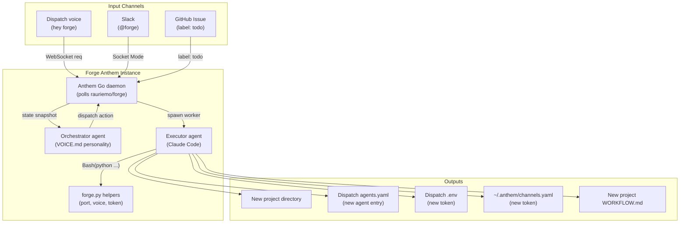

# Forge: Project Scaffolding Agent

## What Forge Is

Forge is a **standalone Anthem instance** that scaffolds new projects. Say "hey forge, create a new project called RPG" and it handles everything: creates the directory, runs `git init`, runs `anthem init`, writes a tailored `WORKFLOW.md`, registers the new agent in Dispatch's `agents.yaml`, assigns a unique voice, generates auth tokens, and reports back with instructions.

Forge is **channel-agnostic** -- Dispatch (voice), Slack, GitHub Issues, or any future channel can invoke it. It sits alongside the other agents in the same tier, not embedded in Dispatch.

Forge is **the orchestrator that builds other orchestrators**.

## Architecture



### Why a separate agent

- **Channel-agnostic**: Slack, WhatsApp, or any future channel can create projects by talking to Forge. If this lived inside Dispatch, other channels would need their own copy.
- **Single responsibility**: Dispatch relays voice commands. Forge scaffolds projects. Clean separation.
- **Anthem-native**: Forge itself runs as an Anthem orchestrator, so it has full access to file system, git, and shell commands through Claude Code.

### How Forge works

When you say "hey forge, create a new project called RPG", Forge:

1. **Creates the project directory** at a configurable base path (e.g., `C:\Users\I9 Ultra\`)
2. **Runs `git init`** (or `git clone` if a repo URL is provided)
3. **Runs `anthem init`** in the new project directory
4. **Edits `WORKFLOW.md`** with project-specific context:
   - Sets `tracker.repo`
   - Configures `channels` with a dispatch entry (next available port)
   - Sets `agent.allowed_tools` based on project type (Python, Unity/C#, Go, etc.)
   - Writes `system.constraints` appropriate for the tech stack
   - Fills in the prompt template
5. **Generates a shared token** for the dispatch channel and adds it to `~/.anthem/channels.yaml`
6. **Registers the new agent in Dispatch's `agents.yaml`**: picks the next available port, assigns a voice from the unused pool, generates token env var name
7. **Adds the token to Dispatch's `.env`**
8. **Adds `workspaces/` to the new project's `.gitignore`**
9. **Reports back** with instructions: "RPG project created at C:\Users\I9 Ultra\RPG. Run `anthem run` in that directory to start the orchestrator. Wake word: hey rpg."

### Port allocation

Current layout:

- 8081: Anthem (anthem project)
- 8082: Dispatch (dispatch project)
- 8083: RebelTower
- 8084: Forge itself

Forge allocates ports for new projects starting from 8085. It reads Dispatch's `agents.yaml` to find what's already used.

### Voice allocation

Forge picks from a pool of unused Google Chirp3-HD voices. Each voice is paired with a free Edge TTS fallback. Already-used voices (Erinome, Algieba, Charon, Leda, and Forge's own Aoede) are excluded from the pool.

### Wake word

Since Picovoice custom wake words require training (1 per month on free tier), new projects use the STT wake pipeline's fuzzy phrase matching. The wake phrase is derived from the project name: "hey rpg", "hey my-app", etc. No `.ppn` file needed.

---

## File Inventory

### Files to create in `C:\Users\I9 Ultra\Forge\`

- `forge.py` -- Helper library: port scanner, voice allocator, token generator, YAML editor, scaffold pipeline
- `tests/test_forge.py` -- Unit tests for all forge.py functions
- `tests/conftest.py` -- Shared fixtures (sample agents.yaml, temp directories)
- `pyproject.toml` -- pytest config + ruff linting config
- `requirements.txt` -- Runtime deps (pyyaml)
- `requirements-dev.txt` -- Test deps (pytest, ruff)
- `WORKFLOW.md` -- Anthem config: tracker, hooks, agent tools, constraints, prompt template
- `CLAUDE.md` -- Architecture doc: scaffolding pipeline, forge.py API, allocation strategies, file paths
- `.gitignore` -- Exclude workspaces/, .env, \_\_pycache\_\_/, etc.
- `.github/workflows/ci.yml` -- Cross-platform pytest + ruff CI

### Files to modify in Dispatch (`C:\Users\I9 Ultra\Dispatch\`)

- `agents.yaml` -- Add `forge` agent entry (type: anthem, port 8084, wake_phrase only)
- `.env` -- Add `FORGE_ANTHEM_TOKEN=<generated>`
- `.env.example` -- Add `FORGE_ANTHEM_TOKEN=` (empty placeholder)

### Files to modify globally

- `~/.anthem/channels.yaml` -- Add `forge: { token: "<same token>" }`

---

## Phase 1: `forge.py` + Tests + Tooling

The helper library is the core deliverable. All scaffolding logic lives here so the Anthem executor can call it reliably. `forge.py` is NOT optional -- without it the executor agent would be doing raw YAML parsing and string manipulation, which is error-prone.

### `forge.py` public API

```python
# Port allocation
def get_used_ports(agents_yaml_path: str) -> list[int]
def next_available_port(agents_yaml_path: str, start: int = 8085) -> int

# Voice allocation
def get_used_voices(agents_yaml_path: str) -> set[str]
def allocate_voice(agents_yaml_path: str) -> tuple[str, str]  # (primary, fallback)

# Token generation
def generate_token(length: int = 32) -> str

# YAML editing (read-modify-write)
def add_agent_to_dispatch(
    agents_yaml_path: str,
    name: str,
    port: int,
    token_env: str,
    voice: str,
    fallback_voice: str,
    wake_phrase: str,
) -> None

def add_token_to_env(env_path: str, key: str, value: str) -> None
def add_token_to_channels_yaml(channels_yaml_path: str, name: str, token: str) -> None

# Scaffold
def scaffold_project(
    base_path: str,
    name: str,
    repo_url: str | None,
    tech_stack: str,
) -> dict  # returns summary with port, voice, wake phrase, path

# Validation
def validate_port_free(port: int) -> bool
def validate_project_name(name: str) -> str  # sanitized name
```

### Voice pool constant

```python
VOICE_POOL = [
    ("google/en-US-Chirp3-HD-Puck",     "en-US-GuyNeural"),
    ("google/en-US-Chirp3-HD-Kore",     "en-US-JennyNeural"),
    ("google/en-US-Chirp3-HD-Fenrir",   "en-US-RogerNeural"),
    ("google/en-US-Chirp3-HD-Sulafat",  "en-US-MichelleNeural"),
    ("google/en-US-Chirp3-HD-Orus",     "en-US-JasonNeural"),
    ("google/en-US-Chirp3-HD-Zephyr",   "en-US-SaraNeural"),
    ("google/en-US-Chirp3-HD-Achernar", "en-US-TonyNeural"),
    ("google/en-US-Chirp3-HD-Gacrux",   "en-US-NancyNeural"),
    ("google/en-US-Chirp3-HD-Vindemiatrix", "en-US-SteffanNeural"),
    ("google/en-US-Chirp3-HD-Sadachbia","en-US-JennyMultilingualNeural"),
]
# Excluded (already assigned):
#   Erinome (Navi), Algieba (Anthem), Charon (Dispatch),
#   Leda (RebelTower), Aoede (Forge itself)
```

### Tests (`tests/test_forge.py`)

Every public function gets tested. Test classes and key assertions:

- **TestPortAllocation** -- Correct port parsing from agents.yaml, gap detection, empty YAML returns start port, malformed YAML raises clear error
- **TestVoiceAllocation** -- Extracts used voices, never returns already-used voice, correct (primary, fallback) tuple, pool exhaustion raises error
- **TestTokenGeneration** -- Hex string of correct length (64 chars for 32 bytes), uniqueness across calls
- **TestYamlEditing** -- Adds correct entry with all fields, preserves existing agents, idempotent (same agent twice does not duplicate)
- **TestEnvEditing** -- Appends key=value, no duplicates, creates file if missing
- **TestChannelsYaml** -- Adds entry under correct key, preserves existing entries
- **TestScaffold** -- Creates directory, writes WORKFLOW.md with correct tracker.repo/channels/constraints, writes .gitignore, calls git init (mocked), returns correct summary dict
- **TestValidation** -- Rejects ports found in agents.yaml, sanitizes names (spaces, special chars, casing), rejects empty/reserved names

All file I/O uses `tmp_path` (pytest built-in). Git/shell commands mocked via `monkeypatch` on `subprocess.run`.

### pyproject.toml

```toml
[tool.pytest.ini_options]
testpaths = ["tests"]

[tool.ruff]
target-version = "py311"
line-length = 100

[tool.ruff.lint]
select = [
    "E",     # pycodestyle errors
    "W",     # pycodestyle warnings
    "F",     # pyflakes
    "I",     # isort
    "UP",    # pyupgrade
    "B",     # flake8-bugbear
    "SIM",   # flake8-simplify
    "RUF",   # ruff-specific rules
]
```

### Dependencies

**requirements.txt**: `pyyaml`

**requirements-dev.txt**: `pytest`, `ruff`

---

## Phase 2: Project Config Files

### WORKFLOW.md

Key decisions:

- `tracker.repo`: `rauriemo/forge` (GitHub repo must exist before `anthem run`)
- `hooks.after_create`: `git clone {{issue.repo_url}} .`
- `hooks.before_run`: `git pull origin main`
- `agent.allowed_tools`: Must include `Bash(python "C:/Users/I9 Ultra/Forge/forge.py" *)` (absolute path -- executor runs in `./workspaces/GH-N/`, not project root)
- `agent.max_concurrent`: 1 (scaffolding is sequential -- prevents port/voice race conditions)
- `system.constraints`: safety rules specific to scaffolding
- `channels.target`: `localhost:8084` (Dispatch channel adapter -- Anthem listens, Dispatch connects in)
- `server.port`: 0 (dashboard disabled -- distinct from channel port)

```yaml
channels:
  - kind: dispatch
    target: "localhost:8084"
    events: [task.completed, task.failed]

agent:
  command: "claude"
  max_turns: 10
  max_concurrent: 1
  stall_timeout_ms: 300000
  max_retry_backoff_ms: 300000
  permission_mode: "dontAsk"
  allowed_tools:
    - "Read"
    - "Edit"
    - "Grep"
    - "Glob"
    - "Bash(git *)"
    - "Bash(anthem init)"
    - "Bash(anthem validate)"
    - "Bash(mkdir *)"
    - 'Bash(python "C:/Users/I9 Ultra/Forge/forge.py" *)'
    - "Bash(python -m pytest *)"
  denied_tools:
    - "Bash(rm -rf *)"
    - "Bash(git push --force *)"

system:
  workflow_changes_require_approval: true
  constraints:
    - "Never delete existing project directories"
    - "Always use forge.py helpers for port allocation, voice allocation, and token generation"
    - "Always check that a port is not already in use before assigning"
    - "Always add workspaces/ to .gitignore in new projects"
    - "Always generate a cryptographically random token for channel auth"
    - "Read the Dispatch project's agents.yaml to determine used ports and voices"
    - "Wake phrases are derived from project name -- no .ppn file needed"
    - "Read CLAUDE.md before making changes"

server:
  port: 0
```

### .gitignore

```
workspaces/
.env
__pycache__/
.venv/
*.log
.claude/
.cursor/
.pytest_cache/
```

### CI pipeline (`.github/workflows/ci.yml`)

```yaml
name: CI
on:
  push: { branches: [main] }
  pull_request: { branches: [main] }

jobs:
  test:
    strategy:
      matrix:
        os: [ubuntu-latest, windows-latest]
    runs-on: ${{ matrix.os }}
    steps:
      - uses: actions/checkout@v4
      - uses: actions/setup-python@v5
        with: { python-version: "3.11" }
      - run: pip install -r requirements.txt -r requirements-dev.txt
      - run: python -m pytest tests/ -v --tb=short
      - run: ruff check .
      - run: ruff format --check .
```

Cross-platform (Windows + Linux) since Forge is Windows-first and path handling needs validation on both OSes.

---

## Phase 3: Connect Forge to Dispatch

### Dispatch `agents.yaml` entry

```yaml
forge:
  type: anthem
  wake_phrase: "hey forge"
  endpoint: ws://localhost:8084
  token_env: FORGE_ANTHEM_TOKEN
  voice: google/en-US-Chirp3-HD-Aoede
  fallback_voice: en-US-EmmaNeural
```

No `wake_word` (.ppn) field -- Forge uses STT wake phrase matching only. `AgentConfig` auto-derives `wake_phrase` from the ppn filename, but when no ppn is provided, the explicit `wake_phrase` field is used by `STTWakePipeline` and `DebugPipeline`.

### Token flow

1. Generate token: `python -c "import secrets; print(secrets.token_hex(32))"`
2. Add to Dispatch `.env`: `FORGE_ANTHEM_TOKEN=<token>`
3. Add to Dispatch `.env.example`: `FORGE_ANTHEM_TOKEN=` (empty placeholder only)
4. Add to `~/.anthem/channels.yaml`: `forge:` entry with `token: "<same token>"`

The token lives in two places: Dispatch's `.env` (client-side, for AnthemAgent to authenticate) and `~/.anthem/channels.yaml` (server-side, for Anthem's Dispatch adapter to verify). Forge itself does NOT need a `.env` -- the Anthem daemon reads the server-side token from `channels.yaml`.

### Verification

Run from the Forge project root:

- `python -m pytest tests/ -v --tb=short` (all tests pass)
- `ruff check .` (no lint errors)
- `ruff format --check .` (formatting consistent)

---

## What Forge Does NOT Do (for now)

- **Does not run `anthem run`** on the new project -- that still requires manual intervention (or the future desktop launcher in Phase 4)
- **Does not create GitHub repos** -- it creates local directories and runs `git init`. Repo creation can be added later with `gh repo create`.
- **Does not manage Picovoice wake words** -- new projects use STT wake phrase matching. Custom `.ppn` files remain a manual step.

### Phase 4 (future): Desktop launcher

A script/shortcut that reads `agents.yaml`, finds all `type: anthem` agents, and runs `anthem run` for each in its respective project directory. Could be a PowerShell script, a `.bat` file, or eventually a system tray menu in Dispatch itself.

---

## Errors and Gaps Found in the Original Architecture Plan

These issues from the original plan are corrected in this consolidated plan:

- **Dashboard port vs channel port confusion**: Original showed `server.port: 8080` alongside `channels.target: localhost:8084`. These are distinct concerns. Fixed: `server.port: 0` (disabled), `channels.target: localhost:8084`.
- **Missing Forge entry in `~/.anthem/channels.yaml`**: Original only mentioned adding tokens for *new projects* Forge creates, not Forge's own token. Fixed: explicit Phase 3b step.
- **`forge.py` called "optional"**: It is critical. Without it the executor agent does raw YAML manipulation. Fixed: required deliverable with full test coverage.
- **Executor runs in workspace, not project root**: `forge.py` lives at `C:\Users\I9 Ultra\Forge\forge.py` but executor runs in `./workspaces/GH-N/`. Fixed: `allowed_tools` uses absolute path.
- **No GitHub repo for Forge**: `tracker.repo: rauriemo/forge` requires the repo to exist. Fixed: flagged as prerequisite.
- **No linter in Dispatch ecosystem**: Neither Dispatch nor the original plan included linting. Fixed: Forge ships with ruff.
- **No CI in Dispatch ecosystem**: No GitHub Actions existed. Fixed: Forge ships with cross-platform CI.
- **Voice pool includes already-used voices**: Original pool included Leda (assigned to RebelTower). Fixed: pool excludes all 5 assigned voices.
- **`wake_word` without `.ppn` file**: Using `wake_phrase` field only, no `wake_word` entry.
- **Token in `.env.example` would leak secret**: Fixed: `.env.example` gets empty placeholder only.
- **No validation of project names**: Fixed: `validate_project_name` sanitizes input.
- **Concurrent scaffolding could cause port race**: Fixed: `max_concurrent: 1` in WORKFLOW.md.
- **Port numbering for new projects**: Forge itself is on 8084, so new projects start at 8085 (not 8084 as original stated).
